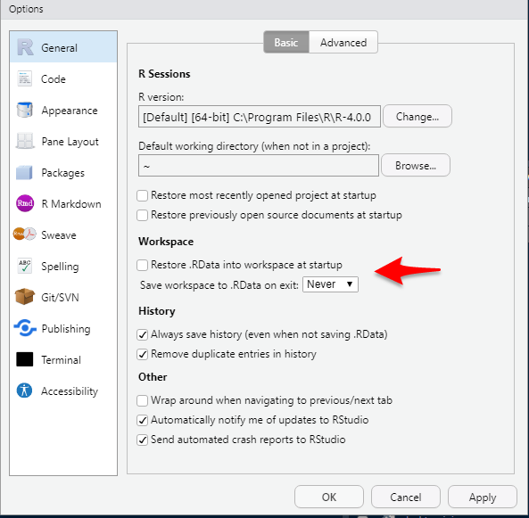

```{r, include = FALSE}
knitr::opts_chunk$set(
  collapse = TRUE,
  comment = "#>",
  warning = FALSE,
  error = TRUE,
  message = FALSE,
  eval = TRUE,
  echo = TRUE
)
```

<center>


# R SETUP GUIDE
Author: Jimmy Briggs  
Date: June 2, 2020

<center/>

***

The purpose of this guide is to provide an in-depth walkthrough of the 
various tasks, installations, and processes involved with setting up your 
machine for using R.

## Installing R & RStudio

The first step is to install R and RStudio from their respective websites listed below.

## Download R

Install R from the main CRAN (Comprehensive R Archive Network) website: 
https://cran.r-project.org/.

+ On the page, select "Download R for Windows" > "Base" > "Download R 4.0.0 for Windows"

+ Note as of today the latest R version is 4.0.0 

+ During installation, ensure that you are installing the 64-bit architecture 
version of R for increased RAM. 

### Additional Notes on R

+ CRAN is composed of a set of mirror servers distributed around the world and 
is used to distribute R and R packages. 

+ Don’t try and pick a mirror that’s close to you: instead use the cloud mirror, 
https://cloud.r-project.org, which automatically figures it out for you.

+ A new major version of R comes out once a year, and there are 2-3 minor
releases each year. It’s a good idea to update regularly.

+ Upgrading can be a bit of a hassle, especially for major versions, which 
require you to re-install all your packages, but putting it off only makes it 
worse. 

For more details see the section discussing how to efficiently migrate R 
packages between versions in this guide.

+ To ease the process up updating your R version it is helpful to use the 
`installr` packge via `installr::updateR()` (run this from the native R 
console not RStudio).


## Download RStudio

Install the free Version of RStudio Desktop for Windows from the RStudio Website here: https://rstudio.com/products/rstudio/download/.

### Additional Notes on RStudio

+ RStudio is an integrated development environment, or IDE, for R programming.

+ RStudio is updated a couple of times a year. When a new version is available, 
RStudio will let you know.

+ It’s a good idea to upgrade regularly so you can take advantage of the latest 
and greatest features.

***

## Configure RStudio Settings

A range of Project Options and Global Options are available in RStudio from the Tools menu (accessible from the keyboard via Alt+T). 

Most of these are self-explanatory but it is worth mentioning a few that can boost
your programming efficiency:

+ I highly recommend unticking the default “Restore .RData” settings box:

<center>



*Unticking this default prevents loading previously created R objects. This will make starting R quicker and reduce the chance of getting bugs due to previously created objects. For this reason, I recommend you untick this box.*

</center>

Alternatively you can simply run this code:

```{r rstudio_settings, eval=FALSE}
require(usethis)
usethis::use_blank_slate(scope = "user")
```

*See `code{?usethis::use_blank_slate` for more information.*

+ GIT/SVN project settings allow RStudio to provide a graphical 
interface to your version control system.

+ R version settings allow RStudio to ‘point’ to different R 
versions/interpreters, which may be faster for some projects.

+ Code editing options can make RStudio adapt to your coding style, for example,
by preventing the autocompletion of braces, which some experienced programmers 
may find annoying. Enabling Vim mode makes RStudio act as a (partial) Vim emulator.

+ Diagnostic settings can make RStudio more efficient by adding additional 
diagnostics or by removing diagnostics if they are slowing down your work.
This may be an issue for people using RStudio to analyze large datasets on older
low-spec computers.

+ Appearance: if you are struggling to see the source code, changing the default
font size may make you a more efficient programmer by reducing the time overheads
associated with squinting at the screen. Other options in this area relate more 
to aesthetics. Settings such as font type and background color are also important
because feeling comfortable in your programming environment can boost productivity.
Go to Tools > Global Options to modify these.

## Installing and Setting Up Additional Software and Utilities

To get the most out of R and RStudio it is helpful to install these additional
software resources:

+ RTools

+	Git

+	A Git Client GUI (or just use RStudio)

+	Git LFS

+	Mercurial

+	Tex Distribution
    - Tinytex
    - Miketex
    - TexLive

+ Java

+	Pandoc

+	Node.js

+	Hugo

+ Inno

Here's the code to install these additional resources:

```{r additional_resources, eval=FALSE}

if (!require(pacman)) install.packages("pacman")

pacman::p_load(devtools, 
               installr, 
               tinytex, 
               rstudioapi, 
               magrittr,
               dplyr,
               pkgbuild)

# configure RStudio settings ----------------------------------------------

# disable reloading of workspace between sessions
usethis::use_blank_slate(scope = "user")

# review system environment variables:
Sys.getenv()

# configure your R library path for R packages
.libPaths()

# copy packages to new R-version's windows library
libdir_prior <- file.path("<enter prior win-library path here>")
libdir_current <- file.path("<enter current win-library path here>")
installr::copy.packages.between.libraries(
  from = libdir_prior, to = libdir_current
)

# check
.libPaths()[1] == libdir 

# configure dotfiles .Rprofile & .Renvrion --------------------------------

# review dotfiles
usethis::edit_r_environ(scope = "user") # (RTools Path, github PAT, keys, etc.)
usethis::edit_r_profile(scope = "user") # (various options for packages)

# additional software ---------------------------------------------
pkgbuild::setup_rtools()

# Rtools
installr::install.rtools()
rstudioapi::restartSession()

# git
installr::install.git()
rstudioapi::restartSession()

# tinytex
tinytex::install_tinytex()
rstudioapi::restartSession()
tinytex::use_tinytex()

# java
installr::install.java()

# pandoc
installr::install.pandoc()

# node.js (only if desired)
installr::install.nodejs()

# github Git Client (only if desired)
installr::install.github()

# inno (only if desired)
installr::install.inno()

```

Note that not all of these are required, however, I recommend at a minimum to 
install RTools, Git, Pandoc, and a Latex service.

I have provided an R script named R-Setup-Script.R with this guide that uses the
`installr` package to help ease the process of installing all these extra 
resources.

## Advanced Configuration

This section discusses more advanced R related configurations such as:

+ Environment Paths 
+ Detailed System Information 
+ Dotfiles 
+ Common pitfalls 

For more advanced R developers you may want to further configure your development
environement by customizing you R related dotfiles;
specifically, your *.Rprofile* and *.Renviron*.

Here is what my minimal setup includes:


Additionally, you can configure keybinding for RStudio addins from RStudio and 
store them within the .R folder located in your *R_USER* path. To view
this path run `Sys.getenv("R_USER")`.

On a windows computer, you may need to adjust where the system chooses to look 
for various R related items on your system. For example, the path to your RTools 
bin executable, your HOME path, your library path for packages, 
and many other windows specific paths. Note the difference between 
SYSTEM PATHS and USER PATHS.

To add your system RTOOLS PATH to your .Renviron 
(easier than manually configuring within windows system settings) run the code:

```{r rtools_path, eval=FALSE}
cat('PATH = ${RTOOLS40_HOME}\\usr\\bin;${PATH}',
    file = fs::path(Sys.getenv("R_USER"), "/.Renviron"), 
    append = TRUE)
```

YOu can also view the allocated memory RAM your machine allows R to use by 
running `forgot the function..`.


